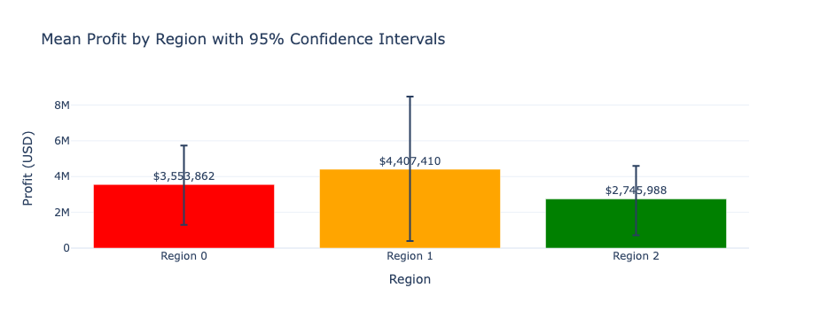
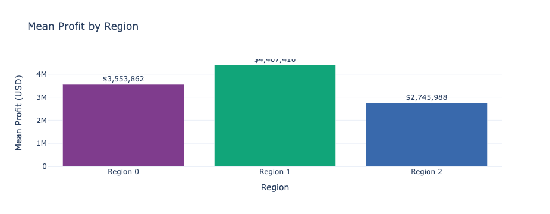
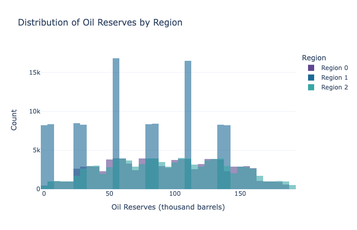

# Wells Profit Prediction

## Project Overview

Machine learning model identifying the most profitable oil well locations using predictive modeling and risk analysis.

---

## Business Problem

An energy company plans to develop new oil wells but must carefully choose which locations to drill. Drilling wells is expensive, and selecting unprofitable sites can result in significant financial losses.

Geological exploration provides data about potential oil reserves in different regions, but the company needs a reliable method to determine which wells are most likely to produce the highest profit.

Without data-driven decision making, the company risks investing in wells that may not generate enough oil to cover drilling costs.

---

## Business Objective

The objective of this project is to use machine learning to predict oil reserves in potential drilling locations and identify the region that offers the highest expected profit while minimizing financial risk.

Possible benefits include:

- Identifying the most profitable drilling locations
- Reducing financial risk when selecting wells
- Supporting data-driven decision making for resource exploration
- Improving investment efficiency in oil production
- Providing statistical estimates of potential profit and risk

---

## Data

The dataset contains geological exploration data from three different regions where the company is considering drilling new wells.

The data is organized into three primary datasets:

* **geo_data_0.csv** — geological features and reserves data for Region 1  
* **geo_data_1.csv** — geological features and reserves data for Region 2  
* **geo_data_2.csv** — geological features and reserves data for Region 3  

Each dataset includes several geological features along with the target variable representing estimated oil reserves for each well.

---

## Exploratory Data Analysis (EDA): Key Insights

Initial analysis of the datasets revealed several useful observations:

* Each region contains **10,000 potential well locations**
* Geological features vary significantly between regions
* The distribution of predicted oil reserves differs across regions
* Some regions show higher average reserves but also higher variability
* Profitability depends not only on average reserves but also on the consistency of high-performing wells

These insights help guide the modeling process and inform the final selection of drilling regions.

---
---

## Visual Analysis

### Mean Profit by Region with Confidence Intervals

This visualization compares the **expected mean profit for each region** based on the selected top 200 wells using bootstrap simulations.  

Region 1 demonstrates the **highest expected profit**, while still remaining below the project's acceptable risk threshold. The confidence intervals illustrate the uncertainty in profit estimates, helping guide the final region selection.

---

### Mean Profit Comparison

This chart highlights the **difference in average profit across regions**. Region 1 again shows the highest average profit, reinforcing its potential as the most profitable development location.

---

### Distribution of Oil Reserves by Region

This distribution plot compares the spread of oil reserves across the three regions. While all regions contain wells with varying reserve sizes, the distribution helps visualize differences in reserve availability and provides context for the profitability calculations used later in the analysis.

---

## Model Development

To predict oil reserves, a **Linear Regression model** was implemented using **Scikit-learn**.

Key steps in the modeling process included:

1. Loading and exploring the geological datasets
2. Splitting each regional dataset into **training and validation sets**
3. Training a **Linear Regression model** to predict oil reserves based on geological features
4. Evaluating model performance using the **Root Mean Squared Error (RMSE)** metric
5. Selecting the top **200 wells** in each region based on predicted reserves
6. Performing **bootstrap sampling** to estimate potential profit and financial risk

The model predicts continuous oil reserve values, making this a **regression task**.

---

## Model Performance

After evaluating predictions and performing profit simulations, **Region 1 demonstrated the highest expected profit while maintaining an acceptable level of financial risk**.

Bootstrapping techniques were used to simulate potential outcomes and calculate the probability of loss. The selected region met the project requirement of keeping the **risk of losses below 2.5%**, making it the safest and most profitable choice for development.

---

## Practical Application

The predictive model and profit simulation approach developed in this project can support real-world decision making for oil exploration companies.

A potential workflow could include:

1. Collecting geological exploration data from potential drilling sites.
2. Using the trained machine learning model to predict oil reserves for each location.
3. Ranking wells based on predicted production potential.
4. Selecting the top-performing wells for further financial evaluation.
5. Running bootstrap simulations to estimate expected profit and risk.
6. Choosing drilling regions that maximize profit while maintaining acceptable risk levels.

By combining machine learning predictions with statistical risk analysis, companies can make more informed decisions about where to invest in drilling operations. This approach helps reduce financial uncertainty while increasing the likelihood of selecting highly profitable oil wells.
